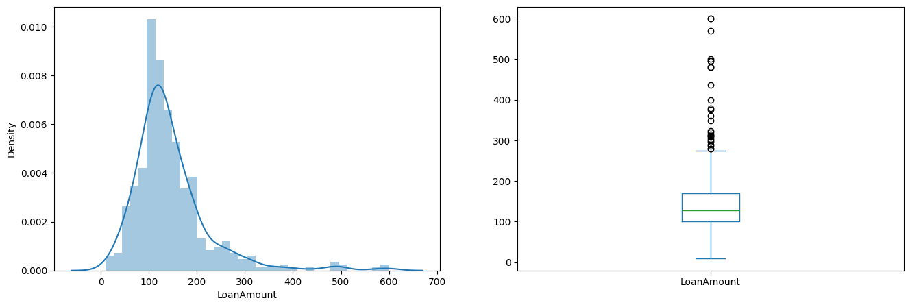
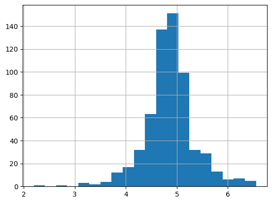
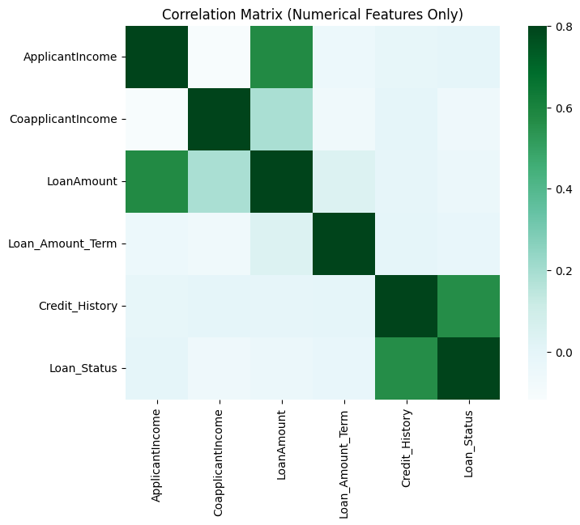
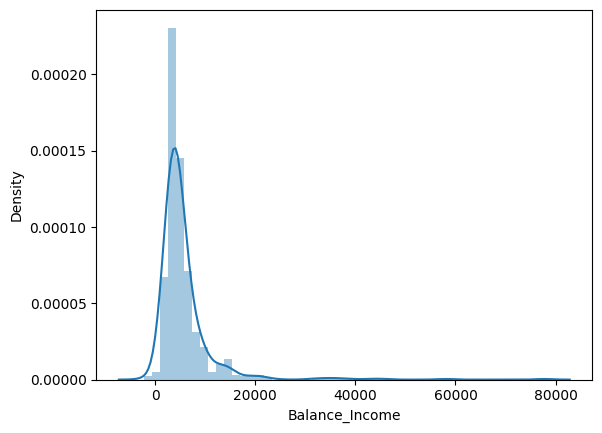
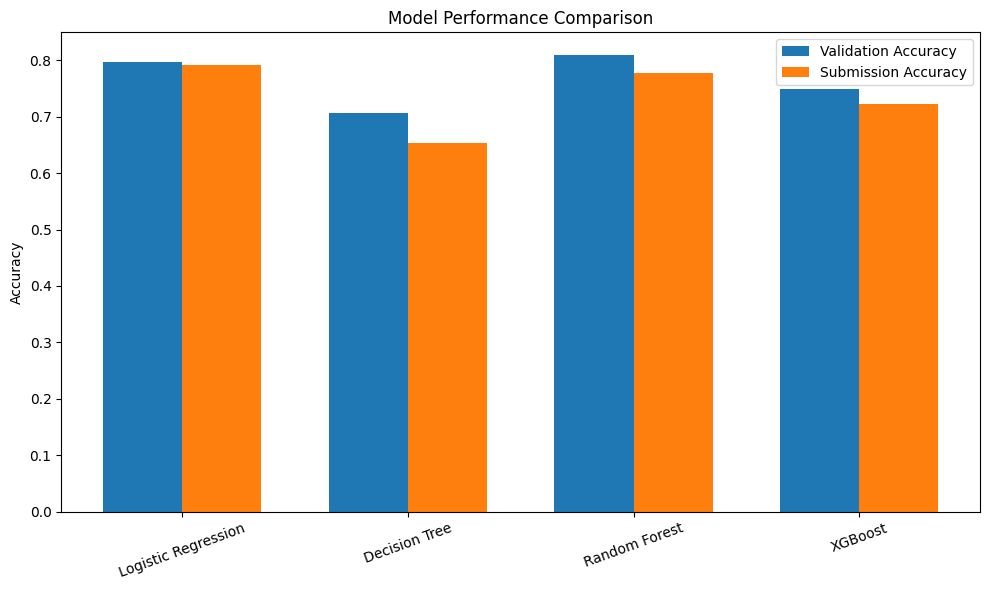
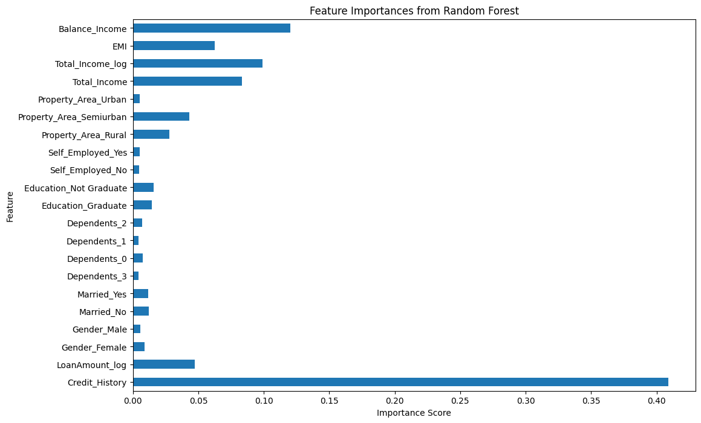

# 🏦 Loan Prediction

This project presents a complete machine learning pipeline for predicting loan eligibility. The solution was developed as part of the **Analytics Vidhya Loan Prediction Practice Problem**.

🔗 Hackathon Link:
[Click here](https://www.analyticsvidhya.com/datahack/contest/practice-problem-loan-prediction-iii/)

📖 Non-Technical Case Study (Notion Version):
[Click here](https://absorbing-sight-c8d.notion.site/Loan-Eligibility-Prediction-306705565b44803490aaebb09ee5c3de)

---

## 📌 Problem Statement

Dream Housing Finance provides home loans across urban, semi-urban, and rural areas. Customers apply online, and the company must assess their eligibility before approving the loan.

The objective of this project is to **automate the loan eligibility process in real-time** using customer information provided during the application process, including:

* Gender
* Marital Status
* Education
* Number of Dependents
* Applicant Income
* Coapplicant Income
* Loan Amount
* Loan Term
* Credit History
* Property Area

Using historical data, we build predictive models to identify applicants likely to be approved for a loan.

---

## 💡 Hypothesis Generation

Based on domain knowledge, the following factors were hypothesised to influence loan approval:

* **Applicant Income:** Higher income increases approval likelihood.
* **Credit History:** Positive credit history strongly increases approval chances.
* **Loan Amount:** Smaller loan amounts are more likely to be approved.
* **Loan Term:** A shorter loan duration may improve approval probability.
* **EMI:** Lower monthly repayment burden increases chances of approval.

These hypotheses were tested using exploratory data analysis and machine learning models.

---

## 📊 Exploratory Data Analysis

Key insights were derived through structured data exploration.

### 📌 Target Distribution

<p align="center">
  
</p>
<p align="center"><i>Figure 1: Distribution of Approved vs Rejected Loan Applications.</i></p>

---

### 📌 Loan Amount Distribution (Before & After Log Transformation)

<p align="center">
  
</p>
<p align="center"><i>Figure 2: Distribution of Loan Amount Variable Before Log Transformation.</i></p>

<p align="center">
  
</p>
<p align="center"><i>Figure 3: Distribution of Loan Amount Variable After Outlier Removal and Log Transformation.</i></p>

---

### 📌 Correlation Heatmap

<p align="center">
  
</p>
<p align="center"><i>Figure 4: Correlation Heatmap Between Numerical Features.</i></p>

---

## 🛠 Feature Engineering

Created new features based on financial reasoning:

* **Total Income**
* **EMI (Equated Monthly Instalment)**
* **Balance Income**
* Log transformations for skewed variables

These features improved model performance by approximately **2–3%** compared to the baseline model.

### 📌 Balance Income Distribution

<p align="center">
  
</p>
<p align="center"><i>Figure 5: Balance Income variable distribution.</i></p>

---

## 🤖 Model Building

Models implemented:

* Logistic Regression (Baseline)
* Logistic Regression with Stratified K-Fold Cross Validation
* Decision Tree
* Random Forest
* XGBoost

---

## 📈 Model Comparison

| Model               | Validation Accuracy | Submission Accuracy |
| ------------------- | ------------------- | ------------------- |
| Logistic Regression | 0.796               | 0.792               |
| Decision Tree       | 0.707               | 0.653               |
| Random Forest       | 0.809               | 0.778               |
| XGBoost             | 0.749               | 0.722               |

### 📌 Model Performance Comparison

<p align="center">
  
</p>
<p align="center"><i>Figure 6: Comparison between Validation Accuracy (test dataset) and Submission Accuracy (hackathon dataset).</i></p>

---

## 🏆 Final Model Selection

**Logistic Regression** was selected as the final model due to:

* Strong and stable generalisation performance
* Minimal overfitting gap between validation and submission
* Simplicity and interpretability
* Computational efficiency

---

## 🔎 Feature Importance

Tree-based models showed:

* **Credit History** as the most influential feature
* Followed by Balance Income, EMI, and Total Income

### 📌 Feature Importance Plot

<p align="center">
  
</p>
<p align="center"><i>Figure 7: Feature Importance Score Plot.</i></p>

---

## ⚙️ Project Setup

### 1️⃣ Create Virtual Environment

```bash
python -m venv venv
source venv/bin/activate
```

### 2️⃣ Install Requirements

```bash
pip install -r requirements.txt
```

### 3️⃣ .gitignore Includes

```
venv/
__pycache__/
.ipynb_checkpoints/
.env
.DS_Store
```

---

## 📁 Repository Structure

```
Loan_Prediction/
│
├── code/
│   ├── data.ipynb
│   ├── submission_logistic.csv
│   ├── submission_logistic_kfolds_validation.csv
│   ├── submission_logistic_2.csv
│   ├── submission_decision_tree.csv
│   ├── submission_random_forest.csv
│   ├── submission_xgboost.csv
│
├── datasets/
│   ├── sample_submission_49d68Cx.csv
│   ├── test_lAUu6dG.csv
│   ├── train_ctrUa4K.csv
│
├── images/
│   ├── target_distribution.png
│   ├── income_distribution.png
│   ├── correlation_heatmap.png
│   ├── balance_income.png
│   ├── model_comparison.png
│   ├── feature_importance.png
│
├── requirements.txt
├── .gitignore
└── README.md
```

---

## 📂 Submission Files

* `submission_logistic.csv` – Baseline Logistic Regression
* `submission_logistic_kfolds_validation.csv` – Logistic Regression with K-Folds
* `submission_logistic_2.csv` – Logistic Regression after feature engineering
* `submission_decision_tree.csv` – Decision Tree results
* `submission_random_forest.csv` – Random Forest results
* `submission_xgboost.csv` – XGBoost results

---

## 🚀 Key Learnings

* Feature engineering significantly improves model performance.
* Financial burden metrics outperform raw income.
* Simpler models can outperform complex ensemble methods.
* Cross-validation prevents overfitting and ensures stability.

---

## 🧠 Technologies Used

* Python
* Pandas
* NumPy
* Matplotlib
* Scikit-learn
* XGBoost

---

## 📌 Author

Hamza Latif
